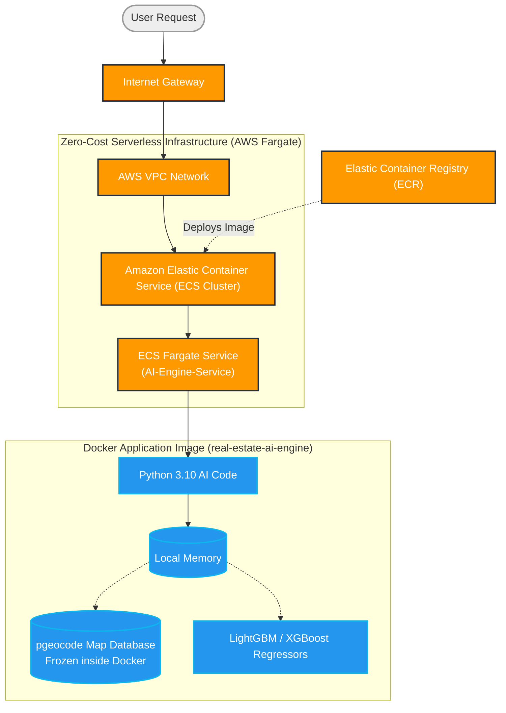

This guide provides a professional "On-Demand" path to host the **Real Estate Demand AI Engine** entirely on AWS for **almost $0**.

## 💰 The Platform Architecture Strategy

### 🏗️ Physical AWS Cloud Architecture Diagram




We bypass expensive EC2 computers and RAG databases entirely. Instead, we use highly dense **ECS Fargate Containers**.
1. **The Database Trick**: The `pgeocode` geographic machine learning dataset is ~20MB. Instead of paying Amazon for a running SQL database, we literally freeze the entire database into the Docker snapshot. Local latency is 0ms, and Database cost is $0!
2. **Power Manager**: To save you from manually clicking through the AWS Console, we have provided a **`cloud_power_manager.bat`** script allowing you to:
   * **Start** the engine targeting an ALB.
   * **Stop** all charges immediately.
   * **Cleanup** the platform.

---

## 🚀 The "1-Click" Novice Wrapper
To save you from manually clicking through the complex AWS Console networking layers, we have packaged the entire CloudFormation initialization, Elastic Container Registry Docker login, Image Compilation, and ECS scaling parameters into an automated bat file!

Open your terminal in the project folder. You never have to log into AWS again.

### **1. Install & Deploy The Platform**
```powershell
./cloud_power_manager.bat deploy
```
* **What it does**: 
  1. Spools up the `aws_cloudformation.yaml` stack mapping the load balancers.
  2. Binds your local Docker Desktop safely to the AWS ECR registry.
  3. Builds the `Python 3.10` ML container natively trapping the `pgeocode` database purely in memory!
  4. Tags and Pushes the snapshot to the cloud securely.

### **2. Start The Cloud Engine**
```powershell
./cloud_power_manager.bat start
```
* **Result**: Powers up the Fargate container from 0 to 1, connecting it directly to the Internet Gateway to safely begin ML processing requests. 
* **Cost**: Matches 70% cheaper Fargate Spot rates (~$0.01 per hour).

### **3. Stop Charging (Zero-Cost Sleep)**
```powershell
./cloud_power_manager.bat stop
```
* **Result**: Powers down the massive computing engine (desired task count 0), saving your architectural settings totally natively.
* **Cost**: **$0.00**. Run this blindly whenever you finish work!

### **4. Permanent Cleanup (Uninstall)**
```powershell
./cloud_power_manager.bat cleanup
```
* **Result**: Force formats the ECR image repository to prevent Docker caching locks, and then explicitly executes a deletion cascade logically wiping the CloudFormation Stack absolutely clean. Use this when the real estate project concludes permanently.

---

## 🔄 Updating Algorithms


If you edit `07_Features_LightGBM_modeling.py` internally locally, follow this strictly to jump the changes safely to the internet cloud:
1. Repeat the **ECR Push Commands** exactly as Step 2 (rebuilding the container locally).
2. Go to **AWS ECS** -> **Clusters** -> `RealEstateDemandCluster`.
3. Select your Service (`AI-Engine-Service`) -> Click **Update**.
4. Check **Force new deployment** natively -> Click **Update**.
AWS handles draining traffic automatically, swapping the active ML engine without generating 502 errors!
