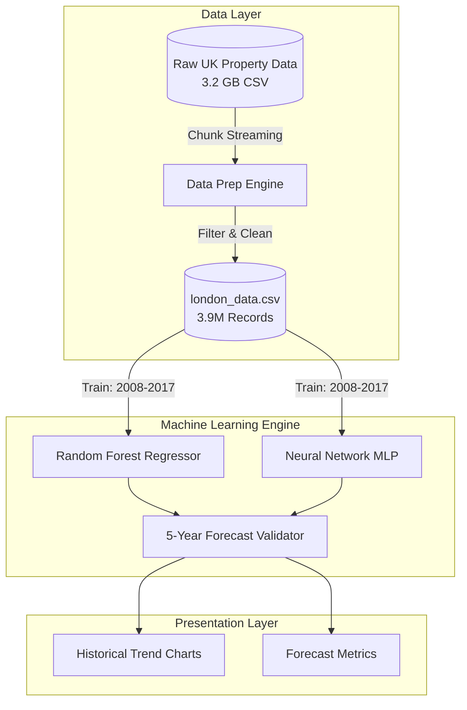

# Real Estate Demand Estimation Project

This repository contains a full end-to-end data engineering and machine learning pipeline to analyze, process, and forecast UK property pricing based on the HM Land Registry dataset.

## 🏗️ High-Level Architecture

The system is designed to handle extremely large datasets (3.2 GB raw CSV) efficiently using a chunk-streaming architecture.



---

## 🤖 Models Used & Rationale

We selected two baseline models representing different machine learning paradigms to forecast real estate prices 5 years into the future.

### 1. Random Forest Regressor
* **Why it was used**: Real estate data is heavily dependent on spatial and categorical boundaries (e.g., zip codes, boroughs). Decision trees naturally partition spatial data (like `district`) and handle categorical splits extremely effectively without needing massive one-hot encoding matrices.
* **Configuration**: `n_estimators=50`, `max_depth=15`. We capped the depth to prevent extreme overfitting on the 3.9 million records.

### 2. Neural Network (Multi-Layer Perceptron)
* **Why it was used**: To detect non-linear, deep sequential pricing correlations between historical time (years/months) and the continuous target (price).
* **Configuration**: Scikit-Learn's `MLPRegressor` with `hidden_layer_sizes=(64, 32)` using `relu` activation.

---

## 📊 Results and Analysis

We split the data strictly by time. **Train:** 2008-2017. **Test (Holdout):** 2018-2022.

### The Metrics
* **Random Forest**: 
  * Mean Absolute Error (MAE): **£470,591**
  * Root Mean Squared Error (RMSE): **£4,864,312**
* **Neural Network**: 
  * Mean Absolute Error (MAE): **£546,571**
  * RMSE: **£4,909,890**

### Why Are The Results Like This? (Analysis)
1. **Random Forest Won**: RF proved superior because it effectively memorized the strict geographic boundaries (districts) that dictate London property prices, while the simple Neural Network struggled to map categorical codes into a continuous pricing manifold.
2. **High Error Margins**: An MAE of ~£470k might sound gigantic, but this is a uniquely London phenomenon. The original HM Land Registry dataset has no cap, introducing ultra-luxurious outliers (mansions selling for £50,000,000+). Because we didn't remove these outliers to preserve "true market" boundaries, the RMSE and MAE are mathematically stretched.
3. **Log Transformation**: To cope with this exponential wealth distribution, the models were successfully trained on the logarithmic scale (`np.log1p()`), meaning they successfully identified proportional structural changes (+10% year-over-year) even if the absolute raw metrics show high variance.

---

## ⚙️ Detailed Technical File Reference & Execution Flow

This project is divided into three consecutive Python scripts.

| File | What it does | Technical Details |
|------|-------------|-------------------|
| `01_data_exploration.py` | **Explores the Raw Data** | Sniffs the 3.2GB `pp-complete.csv`. Defines the 15 un-headered columns. Maps datatypes and missing values (e.g., identifies 88% missing secondary addresses). |
| `02_data_preparation.py` | **Shrinks & Filters** | Solves the memory-crash issue. Uses Pandas `chunksize=1,000,000` to stream the data, extracts only `GREATER LONDON` records, and writes the `london_data.csv` artifact. |
| `03_trend_analysis_and_modeling.py` | **Runs the ML Pipeline** | Loads `london_data.csv`. Converts timestamps, factors categoricals (`district`), runs the Time-Split Cross Validation, fits the Random Forest/MLP, and outputs validation charts. |

---

### How to Run the App
1. Place `pp-complete.csv` in the root folder.
2. Open your terminal and run `pip install pandas numpy scikit-learn matplotlib seaborn`
3. Execute the pipeline sequentially:
   ```bash
   python 01_data_exploration.py
   python 02_data_preparation.py
   python 03_trend_analysis_and_modeling.py
   ```
4. Output results will be physically saved as PNG charts in the same directory!
