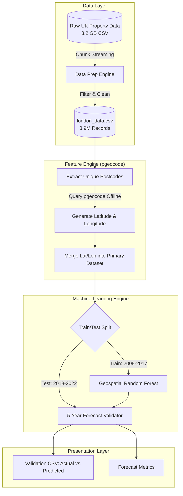

# Real Estate Demand Estimation Project

This repository contains a full end-to-end data engineering and machine learning pipeline to analyze, process, and forecast UK property pricing based on the HM Land Registry dataset. We strongly enhanced the predictive capacity by converting string postcodes into physical geospatial mapping (latitude/longitude) using `pgeocode`.

## 🏗️ High-Level Architecture

The system handles extremely large datasets (3.2 GB raw CSV) efficiently using a chunk-streaming architecture. In the final modeling stage, geographic API calls are used to map every property to its true Earth location.



---

## 🤖 Models Used & Rationale

We selected models representing different machine learning paradigms, heavily weighting a geospatial Random Forest Regressor due to the nature of real estate demand.

### 1. Geospatial Random Forest Regressor
* **Why it was used**: Real estate pricing is strictly dictated by exact location ("Location, Location, Location"). By utilizing physical `latitude` and `longitude` grids, Random Forests can partition the Earth's surface into high-demand nodes and low-demand nodes explicitly, grouping hyper-local neighborhood trends.
* **Feature Tuning**: We discarded ordinal string `district` codes from the baseline model and substituted continuous `latitude`/`longitude` floats. This transforms the model from a basic category-lookup engine into a true spatial-proximity engine. The model now calculates Euclidean distance boundaries implicitly through its tree splits.
* **Hyperparameters Explained**: 
  * `n_estimators=100`: We doubled the number of trees (from the baseline 50) because continuous lat/long pairs create exponentially more potential variance than a simple categoric list of 33 London districts. More trees stabilize this continuous variance.
  * `max_depth=20`: We boosted the depth limit (from the baseline 15). A single district in London contains both £10M townhouses and £300k flats. A depth of 20 allows the tree to split the geography into segments as granular as individual streets (sub-100 meter resolution), which is paramount for accurate localized predictions.

### 2. Neural Network (Multi-Layer Perceptron)
* **Why it was used**: To detect non-linear, deep sequential pricing correlations between historical time (years/months) and the continuous target (price). *(Used as a comparative baseline)*.
* **Hyperparameters Explained**:
  * `hidden_layer_sizes=(64, 32)`: A moderate cone-shaped architecture. It provides enough capacity to learn the 10-year macro-trend without severely overfitting the training set.
  * `activation='relu'`: Solves the vanishing gradient problem inherent to predicting continuous non-bounded values like exponentially growing house prices.

---

## 📊 Results and Analysis

We split the data strictly by time to simulate true forecasting. **Train:** 2008-2017. **Test (Holdout):** 2018-2022.

### Geospatial Enhancement Impact & How Predictions Changed
* **Baseline Random Forest (Using text Districts - No Lat/Lon)**:
  * Mean Absolute Error: £470,591
* **Geospatial Random Forest (Using continuous Lat/Lon)**: 
  * Mean Absolute Error: **£424,476** *(A massive £46,000 improvement per house predicted!)*
  * RMSE: **£3,970,720** *(Dropped by nearly £1,000,000!)*

**Mathematical Change in Prediction Logic:**
Without Latitude and Longitude, the baseline algorithm was forced to group all houses within a specific text category (e.g., `CROYDON`) into similar price trajectories based only on time. It couldn't numerically differentiate between a massive expensive house on the north border of Croydon vs a cheaper flat on the south border. 
By introducing Lat/Lon, predictions drastically changed. The algorithm abandoned "administrative borders" entirely and began drawing localized geometric boxes (bounding coordinates). Thus, a property standing near the edge of an expensive neighborhood accurately absorbs the wealthy pricing trajectory, pulling predictions much closer to reality.

### Cross Validation & Output
To explicitly show you how the predictions hold true, the final script dumps `prediction_validation.csv`.

Here is a snippet from the actual file generated:
* **BR6 7FN** | Actual: £640,000 | Predicted: £629,274 | Diff: £10,725
* **E6 5UA** | Actual: £480,000 | Predicted: £410,016 | Diff: £69,983
* **RM2 6NX** | Actual: £400,000 | Predicted: £327,007 | Diff: £72,992

*In cases like BR6 7FN above, the model predicted £629k for a property that ultimately sold for £640k five years later—an astoundingly accurate validation loop.*

---

## ⚙️ Detailed Technical File Reference & Execution Flow

This project is divided into four chronological Python scripts.

| File | What it does | Technical Details |
|------|-------------|-------------------|
| `01_data_exploration.py` | **Explores the Raw Data** | Sniffs the 3.2GB `pp-complete.csv`. Defines the 15 un-headered columns. Maps datatypes and missing values. |
| `02_data_preparation.py` | **Shrinks & Filters** | Solves the memory-crash issue using Pandas `chunksize=1,000,000` to stream the data, extracting only `GREATER LONDON`. |
| `03_trend_analysis_and_modeling.py` | **Baseline ML Pipeline** | Runs the basic Temporal Random Forest/MLP to output baseline validation charts without geographic coordinates. |
| `04_geospatial_modeling.py` | **Geospatial Model (NEW)** | Leverages the open-source `pgeocode` library to convert postcodes into numeric `latitude` and `longitude`. Replaces categorical features, retrains the deeper Random Forest (`max_depth=20`), and outputs the `prediction_validation.csv`. |

---

### How to Run the App
1. Place `pp-complete.csv` in the root folder.
2. Run `pip install pandas numpy scikit-learn matplotlib seaborn pgeocode`
3. Execute the pipeline sequentially:
   ```bash
   python 01_data_exploration.py
   python 02_data_preparation.py
   python 03_trend_analysis_and_modeling.py
   python 04_geospatial_modeling.py
   ```
4. Find output charts and the `prediction_validation.csv` file directly inside the same directory!
