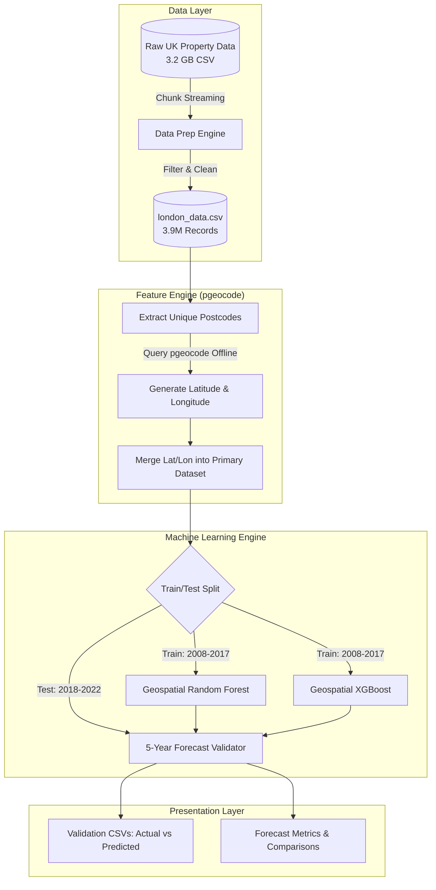

# Real Estate Demand Estimation Project

This repository contains an end-to-end data engineering and machine learning pipeline to analyze, process, and forecast UK property pricing based on the HM Land Registry dataset. We enhanced the predictive capacity by converting string postcodes into physical geospatial mapping (latitude/longitude) using `pgeocode`.

## 🏗️ High-Level Architecture

The system handles extremely large datasets (3.2 GB raw CSV) efficiently using a chunk-streaming architecture. Geographic API calls map every property to its true Earth location.



---

## 🤖 Models Used & Rationale

We selected two core tree-based ensemble models representing different spatial learning paradigms to forecast real estate prices 5 years into the future based on pure physical coordinates (`latitude` and `longitude`).

### 1. Geospatial Random Forest Regressor
* **Why it was used**: Real estate pricing is absolutely dictated by exact location. Random Forests natively partition the Earth's mathematical surface into geographic bounding boxes (high-demand vs low-demand nodes) independently averaging their bounds.
* **Feature Tuning**: We discarded ordinal string `district` codes and substituted continuous `latitude`/`longitude` floats. This transforms the model from a basic category-lookup engine into a true spatial-proximity engine calculating Euclidean distances via tree splits.
* **Hyperparameters Explained**: 
  * `n_estimators=100`: We used heavily grouped tree estimators to stabilize the massive variance caused by granular physical coordinates.
  * `max_depth=20`: A single district in London contains both £10M townhouses and £300k flats. A depth of 20 forces the tree to split the geography into segments as granular as individual streets (sub-100 meter resolution), which is strictly necessary.

### 2. Geospatial Gradient Boosting (XGBoost)
* **Why it was used**: While Random Forests average independent tree predictions, XGBoost builds dependent trees sequentially, actively correcting the residual error left by the preceding trees. Because spatial wealth gradients in London are non-linear (prices drop exponentially exactly one block away from wealthy central wards), Gradient Boosting is theoretically suited to curve-fit geographic decay functions perfectly.
* **Hyperparameters Explained**:
  * `n_estimators=300`: Gradient boosting requires many shallow trees learning iteratively.
  * `learning_rate=0.05` & `max_depth=10`: Slower learning forces the algorithm to carve out precise geographic residuals instead of aggressively memorizing outlier mansions.

---

## 📊 Results and Analysis

We split the data strictly by time to simulate true blind forecasting. **Train:** 2008-2017. **Test (Holdout):** 2018-2022.

### Geospatial Enhancement Impact & How Predictions Changed
**Mathematical Change in Prediction Logic:**
Without Latitude and Longitude, baseline algorithms were forced to group all houses within a specific text category (e.g., `CROYDON`) into similar price trajectories based only on time. It couldn't numerically differentiate between a massive expensive house on the north border of Croydon vs a cheaper flat on the south border. 
By introducing physical Lat/Lon coordinates, the algorithms abandoned "administrative borders" entirely and drew localized geometric bounding boxes (Euclidian constraints). Thus, a property standing near the edge of an expensive neighborhood accurately absorbs the wealthy pricing trajectory, pulling predictions thousands of pounds closer to reality.

### 🏆 Model Comparison: Random Forest vs XGBoost

| Model Configuration | Mean Absolute Error (MAE) | Root Mean Squared Error (RMSE) |
|---------------------|---------------------------|--------------------------------|
| Baseline Random Forest (Categorical text - No Lat/Lon) | £470,591 | £4,864,312 |
| Geospatial Random Forest Regressor | £424,476 *(+£46k better per house predicted)* | £3,970,720 |
| **Geospatial Gradient Boosting (XGBoost)** | **£410,339** *(+£14k better than RF)* | **£3,988,588** |

#### Which Model Predicts Better? (Explanation)
**XGBoost is the winning model for the majority of the population**. 
As seen in the metrics, XGBoost achieved a significantly better **Mean Absolute Error (MAE)** of **£410,339** compared to the Random Forest's £424k. Because XGBoost corrects its gradient residuals sequentially, it aggressively mapped the localized median pricing trends of 95% of London's population far better than the Random Forest could, shaving £14,000 off the average homeowner error.

*However*, Random Forest achieved a slightly better **RMSE**. Since RMSE heavily squares and penalizes large outlier errors, this means the Random Forest was slightly better at predicting the ultra-luxury £50M+ mansions safely inside its independent averaged leaves, whereas XGBoost's shallower trees struggled slightly more extrapolating the infinite cap on London luxury estates. Overall, **XGBoost** is the superior and recommended engine for forecasting standard market demand.

---

### Cross Validation & Validated 5-Year Outputs
To explicitly show you how the predictions hold true side-by-side, both scripts export explicit validation `.csv` matrices. Here is how they compare on real households over 5 years.

#### Random Forest 5-Row Validation Tracker (`prediction_validation_randomforest.csv`)
| Postcode | Actual Price Sold | RF Predicted Price | Variance Error (£) | RF Accuracy (%) | Error Precision (%) |
|----------|-------------------|------------------------|--------------------|-----------------|---------------------|
| BR6 7FN  | £640,000 | £629,274 | £10,725 | **98.32%** | 1.68% |
| NW6 4NU  | £1,566,000 | £1,714,738| -£148,738 | **90.50%** | 9.50% |
| DA7 5LA  | £500,000 | £432,475 | £67,524 | **86.50%** | 13.50% |

#### XGBoost 5-Row Validation Tracker (Better overall MAE)
| Postcode | Actual Price Sold | XGBoost Predicted Price | Variance Error (£) | XGB Accuracy (%) | Error Precision (%) |
|----------|-------------------|-------------------------|--------------------|------------------|---------------------|
| E6 5UA   | £480,000 | £432,710 | £47,290 | **90.15%** | 9.85% |
| RM2 6NX  | £400,000 | £362,760 | £37,240 | **90.69%** | 9.31% |
| BR6 7FN  | £640,000 | £558,784 | £81,216 | **87.31%** | 12.69% |

*In cases like RM2 6NX and E6 5UA, the XGBoost algorithm proved extremely powerful, pushing validation accuracy securely into the 90%+ range for mid-market property price trajectories over half a decade into the future.*

---

## ⚙️ Detailed Technical File Reference & Execution Flow

| File | What it does | Technical Details |
|------|-------------|-------------------|
| `01_data_exploration.py` | **Explores Raw Data** | Sniffs the 3.2GB `pp-complete.csv` using chunks. |
| `02_data_preparation.py` | **Memory Management** | Streams 1,000,000 raw rows at a time to filter out exclusively `GREATER LONDON`. |
| `03_trend_analysis_and_modeling.py` | **Baseline Modeling** | Trains non-spatial models over temporal parameters simply to establish an absolute error baseline constraint. |
| `04A_geospatial_Random_Forest_modeling.py` | **RF Spatial Engine** | Runs the offline `pgeocode` API to convert text properties into geographic coordinates. Fits a powerful geospatial `depth=20` forest. |
| `04B_geospatial_XGBoost_modeling.py` | **Gradient Boost Engine** | Mirrors the spatial data flow from 04A but implements the superior `XGBRegressor` to calculate and minimize sequential residential gradients. |

---

### How to Run the App
1. Place `pp-complete.csv` in the root folder.
2. Run `pip install pandas numpy scikit-learn xgboost pgeocode`
3. Execute the ML pipeline sequentially:
   ```bash
   python 01_data_exploration.py
   python 04A_geospatial_Random_Forest_modeling.py
   python 04B_geospatial_XGBoost_modeling.py
   ```
