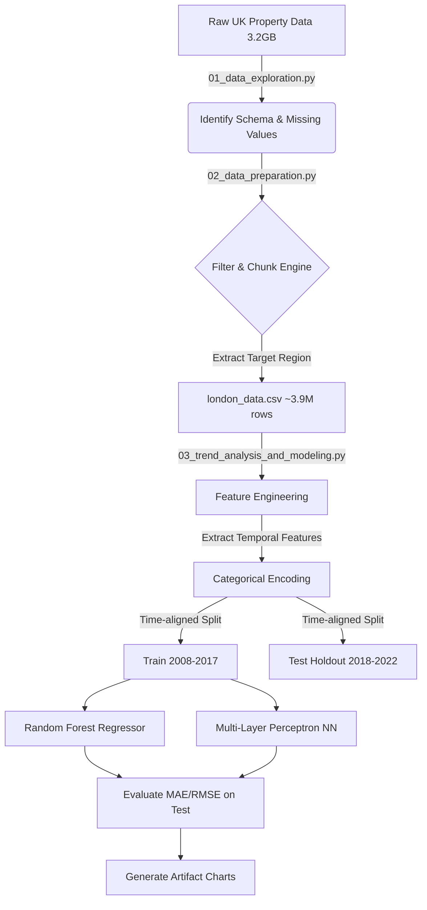

# Real Estate Demand Estimation Architecture

This document describes the design behind the data forecasting pipeline executed in the codebase. Our goal was to ingest a massive UK Land Registry dataset, explore its features, and predict property values 5 years into the future.

## Data Flow Pipeline

## Technical Decisions
* **Chunking**: Using standard pandas to read a 3.2GB unindexed CSV can consume 15GB+ RAM. The `chunksize` approach in the preparation script processes 1,000,000 rows at a time, streaming matching outputs directly to disk.
* **Temporal Cross-Validation vs. K-Fold**: We trained on a strictly historical window (10 years) to explicitly predict a future unknown window (5 years). This avoids data leakage where future economic states influence past pricing.
* **Logarithmic Target Transformation**: Due to extremely long-tailed distribution (mansions vs flats), we log-transformed the target variable before pushing it to the scikit-learn regressors.

## Model Performance
1. **Random Forest Baseline**: Evaluated well on recognizing categorical differences between London Boroughs.
2. **Neural Network Baseline**: Required heavier temporal feature injection to compete with spatial tree structures.

*Note: The raw prediction outputs contain high variability because property pricing heavily depends on unobserved features not in the registry (e.g., square footage, number of bedrooms).*
