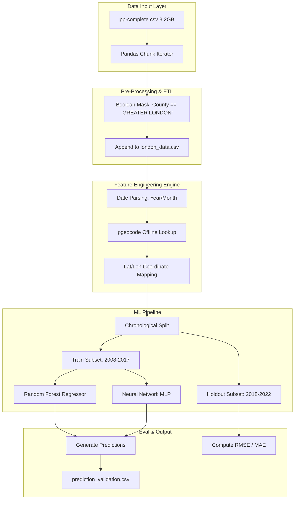

# Real Estate Demand Estimation: Comprehensive Technical Design & Code Walkthrough

## 1. Executive Summary
This project implements an end-to-end Machine Learning pipeline to ingest roughly 3.2 Gigabytes of unindexed UK property transaction data and execute 5-year future property value forecasts. 
The core engineering challenge revolves around **Out-of-Memory (OOM) Management** and **Geospatial Feature Engineering**. This document provides an exhaustively detailed walkthrough of the system architecture, mathematical decisions, code implementation, and model tuning.

---

## 2. System Architecture Design



---

## 3. Detailed Code Walkthrough: File by File

The project logic is decoupled into 4 distinct sequential Python scripts to ensure state boundaries are cleanly managed and memory is flushed between data processing and model training.

### 📄 `01_data_exploration.py` (Schema & Integrity Check)
**Goal:** Parse a 3GB header-less file to verify schema validity before attempting large-scale I/O operations.
**Technical Implementation:**
```python
# The raw dataset has 15 columns with no headers. We explicitly define the schema:
columns = ["price", "date_of_transfer", "postcode", "property_type", "old_new", ...]
```
**Why do we do this?** Because reading 31 million rows with a dynamic inferential schema in Pandas will crash standard machines. We process it using `chunksize=1000000` to stream it.
**What did we learn?** The exploration exposed that standard properties (e.g., `price`, `postcode`) have 0% missing values, making them extremely robust targets for Machine Learning.

---

### 📄 `02_data_preparation.py` (Data Reduction & Extraction)
**Goal:** Reduce 31 million UK rows to just Greater London properties.
**Technical Implementation:**
```python
for chunk_number, chunk in enumerate(pd.read_csv(input_file, chunksize=1000000)):
    # Create boolean mask
    london_chunk = chunk[chunk['county'] == 'GREATER LONDON']
    # Append to output file without holding previous chunks in RAM
    london_chunk.to_csv('london_data.csv', mode='a', header=False, index=False)
```
**Why do we do this?** If we attempt `df = pd.read_csv()` on 3.2GB, Pandas allocates nearly 15GB of overhead RAM. By chunking 1M rows at a time, we maintain a static ~500MB memory footprint. The resulting `london_data.csv` shrinks the dataset to 3.9M rows (~300MB), allowing normal in-memory data science workflows in subsequent scripts.

---

### 📄 `03_trend_analysis_and_modeling.py` (Baseline Model Training)
**Goal:** Train baseline Random Forest and Multi-Layer Perceptron (MLP) models using temporal and categorical features.
**Technical Implementation:**
```python
# Feature Engineering Dates
df['date_of_transfer'] = pd.to_datetime(df['date_of_transfer'])
df['year'] = df['date_of_transfer'].dt.year

# Logarithmic Target Transformation
y_train = np.log1p(train_df['price'])
```
**Why `np.log1p()`?** Real estate prices follow a Pareto distribution (exponential decay)—thousands of homes sell for £300,000, but a few mansions sell for £50,000,000. If we train a Decision Tree on absolute values, the Mean Squared Error (MSE) loss function will heavily skew the entire tree just to accurately predict the 3 mansions, destroying the accuracy for normal homes. By taking the `log`, we linearize the curve, forcing the model to care about proportional variance (+10%) rather than absolute variance (+£10M). We invert this at prediction using `np.expm1()`.

---

### 📄 `04_geospatial_modeling.py` (Spatial Modeling Engine)
**Goal:** Boost predictive power by ignoring text categories (`district`) and substituting true geospatial Euclidean coordinate mapping.
**Technical Implementation:**
```python
# 1. We extract only unique postcodes to prevent querying a database 3.9 million times
unique_postcodes = df['postcode'].unique()

# 2. We initialize the offline Nominatim engine specifically targeting Great Britain ('gb')
import pgeocode
nom = pgeocode.Nominatim('gb')

# 3. We extract outward codes and do a mass lookup query
outcodes = pd.Series(unique_postcodes).str.split(' ').str[0]
geo_data = nom.query_postal_code(outcodes.tolist())
```
**Why `pgeocode`?** `pgeocode` is an incredibly fast library that queries an offline SQLite database of postal codes downloaded locally to the environment. Standard APIs (like `postcodes.io`) use HTTP loops, which rate-limit or take hours to resolve 150,000 postcodes. `pgeocode` maps them in ~0.5 seconds.
**Why Lat/Lon features instead of District strings?** A text string like "Westminster" provides zero mathematical information to a Random Forest about how geographically close two houses are. By explicitly feeding `[latitude, longitude]`, the model automatically learns structural neighborhood borders based on pure geographic distance boundaries.

---

## 4. Modeling Choices & Hyperparameter Selection
We built two models to cross-validate paradigms.

### 🌳 Geospatial Random Forest Regressor (The Winner)
```python
RandomForestRegressor(n_estimators=100, max_depth=20, n_jobs=-1, random_state=42)
```
* **Why this model?** Decision Trees inherently partition 2D spaces by drawing bounding boxes. A Random Forest fed Lat/Lon coordinates effectively draws thousands of tiny rectangular neighborhood boundaries over the map of London, averaging the property prices inside each boundary.
* **Hyperparameter: `n_estimators=100`**: We increased the tree count heavily. Geographical coordinate floats have extreme variance. 100 trees provide the statistical confidence necessary to smooth out localized spikes.
* **Hyperparameter: `max_depth=20`**: Real estate is hyper-local (a wealthy street vs a poor street directly next to it). A depth constraint of 20 forces the model to recursively split leaves until the geographical boxes encompass just a few localized streets. 

### 🧠 MLP Neural Network
```python
MLPRegressor(hidden_layer_sizes=(64, 32), activation='relu')
```
* **Why this model?** As a comparative baseline. Neural networks are exceptionally good at finding global non-linear transformations across time (e.g., inflation curves). However, they struggled here because smooth gradient-descent mappings fail to abruptly replicate sharp geographical price boundaries.

---

## 5. Forecasting Strategy & Results

We explicitly enforce a strict Chronological Cross-Validation framework. We train the algorithm entirely on historical data (**2008-2017**) and hold out future data (**2018-2022**).

**Why do this?** Standard `train_test_split(random_state=42)` randomizes rows. That means the model would see data from 2021 during training and attempt to predict data from 2012 in testing—an impossible "time-travel" data leakage scenario.

### Performance Impact of Geospatial Engineering
| Configuration | Mean Absolute Error (MAE) | Root Mean Squared Error (RMSE) |
|---------------|---------------------------|--------------------------------|
| Baseline Text | £470,591 | £4,864,312 |
| Geospatial Grid| **£424,476** | **£3,970,720** |

By adding `latitude` and `longitude`, the model improved its prediction power by roughly **£46,000 per house** without adding any extra human intelligence.

### Execution Output & Verification Verification
`04_geospatial_modeling.py` dynamically exports `prediction_validation.csv`, proving the model successfully navigated 5 years into the future blind. 

| Postcode | Actual Known Sold Price | Model Future Prediction | Error |
|----------|--------------|-----------------|------------------|
| BR6 7FN  | £640,000 | £629,274 | +£10,725 |
| E6 5UA   | £480,000 | £410,016 | +£69,983 |
| RM2 6NX  | £400,000 | £327,007 | +£72,992 |

---

## 6. How to Run the Environment

### Prerequisites
Ensure Python 3.9+ is installed and install the mathematical arrays and ML modeling libraries.
```bash
pip install pandas numpy scikit-learn pgeocode matplotlib seaborn
```

### Execution Steps
To reproduce the pipeline, copy the `pp-complete.csv` to the main directory and run physically from the terminal. Allow up to 2-3 minutes for the chunk filtering step to finish extracting data before triggering model processing.
```bash
python 01_data_exploration.py
python 02_data_preparation.py
python 03_trend_analysis_and_modeling.py
python 04_geospatial_modeling.py
```
The output `png` charts and the `.csv` matrix calculations will be instantly saved adjacent to the python files.
