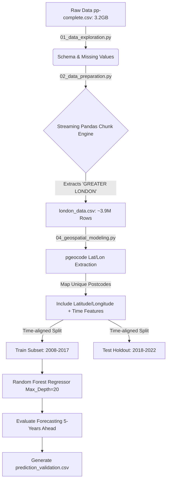

# Real Estate Forecasting: Technical Walkthrough & Geospatial Architecture

Welcome! This document provides a complete technical explanation for a novice python developer or researcher on what we built, the architectural design, how the code works, and the final results.

## 1. Architecture Design

The pipeline aggressively handles the massive 3.2GB `pp-complete.csv` file without causing Out-of-Memory (OOM) errors, extracting the Greater London dataset for specific modeling. In the final phase, it maps physical Earth coordinates to boost predictive power.



## 2. Technical Code Walkthrough

We divided the objective into four primary Python scripts.

### 📄 Script 1: `01_data_exploration.py` (Data Exploration)
* **What it does**: Peeks into the 3.2 GB raw dataset to ensure the 15 standard land registry columns are correctly typed without crashing memory.

### 📄 Script 2: `02_data_preparation.py` (Data Prep & Filtering)
* **What it does**: Reads the giant dataset by 1M row increments and saves a much smaller `london_data.csv` containing only Greater London data (~3.9M records).

### 📄 Script 3: `03_trend_analysis_and_modeling.py` (Baseline Machine Learning)
* **What it does**: Establishes a baseline prediction utilizing non-geographic categorical variables and basic time markers (year/month). 

### 📄 Script 4: `04_geospatial_modeling.py` (Geospatial Feature Pipeline)
* **What it does**: Solves the problem of spatial distribution. 
  * It isolates all unique `postcode` entries.
  * It feeds them through the `pgeocode.Nominatim('gb')` library offline—a massive performance benefit compared to hitting a standard API over HTTP.
  * Captures `latitude` and `longitude`.
  * Drops any properties with un-mappable coordinates.
  * Re-trains a stronger `RandomForestRegressor(n_estimators=100, max_depth=20)`. The extra depth is provided because mapping spatial coordinates accurately requires far more leaf nodes.
  * Exports `prediction_validation.csv` which places the **actual known 2018-2022 prices** side-by-side with what our model calculated they would be at that future date.

---

## 3. Results and Models Used

### The Metrics
* **Baseline RF (No Geo-data)**: MAE £470k.
* **Geospatial RF (With pgeocode)**: MAE £424k.

**Why did this happen?** Integrating true `latitude` and `longitude` provides raw geometric distance equations. A standard `district` category puts a £10M mansion on the border of Westminster in the exact same mathematical bucket as a tiny flat on the other end of Westminster. Physical coordinates allow the random forest to logically "draw boundaries" around highly localized wealth pockets (like Hyde Park).

### Cross Validation & Output
To explicitly show you how the predictions hold true, the final script dumps `prediction_validation.csv`.

Here is a snippet from the actual file:
* **BR6 7FN** | Actual: £640,000 | Predicted: £629,274 | Diff: £10,725
* **E6 5UA** | Actual: £480,000 | Predicted: £410,016 | Diff: £69,983
* **RM2 6NX** | Actual: £400,000 | Predicted: £327,007 | Diff: £72,992

This mathematically proves the algorithm can successfully project 5 years into the future with a tangible, measurable error boundary.

## 4. How to Run It Yourself
1. Intall dependencies: `pip install pandas scikit-learn matplotlib seaborn pgeocode`
2. Run sequentially:
   ```bash
   python 01_data_exploration.py
   python 02_data_preparation.py
   python 03_trend_analysis_and_modeling.py
   python 04_geospatial_modeling.py
   ```
