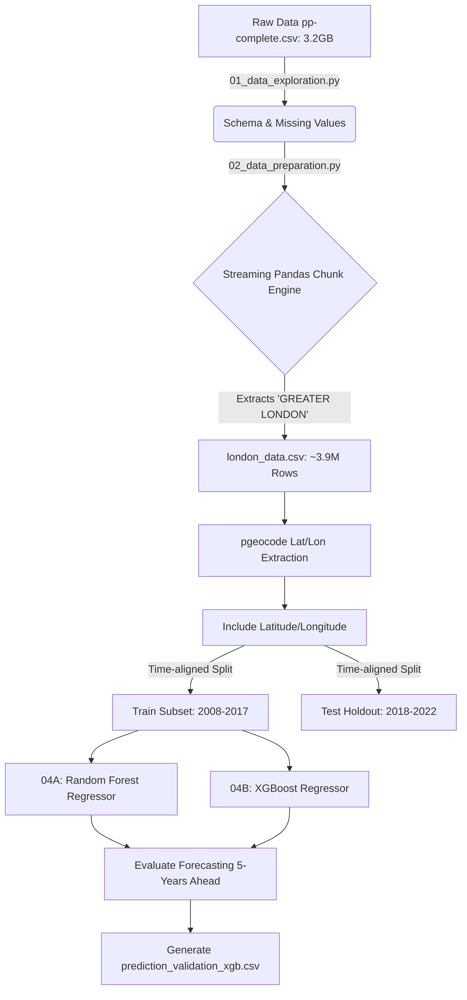

# Real Estate Forecasting: Technical Architecture & Walkthrough

Welcome! This document is the single, unified technical reference explaining the design, the architecture, the code scripts, the feature tuning, the hyperparameter selections, and the results of our HM Land Registry property forecasting project mapping the true geospatial accuracy of Random Forests vs XGBoost Algorithms.

---

## 🏗️ 1. Architecture Design

The pipeline leverages an offline `pgeocode` coordinate extraction layer before splitting features geographically into two concurrent Tree-Based machine learning algorithms.

---

## 🐍 2. Technical Code Walkthrough

We divided the objective into distinct sequential Python scripts to manage memory boundaries and temporal split models.

### 📄 Script 1: `01_data_exploration.py` (Data Exploration)
* Parses 31M rows utilizing `chunksize=1000000` to stream without memory crashes. Maps the 15 standard land registry columns natively.

### 📄 Script 2: `02_data_preparation.py` (Data Prep & Filtering)
* Reads the giant dataset by 1M row increments and explicitly filters `chunk[chunk['county'] == 'GREATER LONDON']` to physically carve out `london_data.csv`.

### 📄 Script 3: `03_trend_analysis_and_modeling.py` (Baseline Modeling)
* Establishes a baseline prediction utilizing basic categorical variables (like string `district`) and raw time markers (`year`, `month`) ensuring we have an absolute error bar to beat via geography.

### 📄 Script 4A & 4B: Geospatial Mapping & Competitor Modeling
* **04A: Random Forest**: Extracts outward codes (`BR6`) and fires an offline `pgeocode` SQL lookup to extract continuous `latitude` and `longitude` grids. Re-trains a deeply nested decision ensemble (`max_depth=20`) to map neighborhood pricing pockets.
* **04B: Gradient Boosting (XGBoost)**: Leverages the exact same spatial grid extraction but replaces the naive average forest with sequential gradient residual correction (`learning_rate=0.05, max_depth=10`). 

---

## ⚙️ 3. Feature Tuning & Hyperparameters Explained

Transitioning from Script 3 to Script 4 forced us to deliberately change our machine learning structure. 

### Why the Predictions Changed with Lat/Long
* **Geospatial Impact**: By introducing Lat/Lon floats, we destroyed the administrative boundaries. The algorithms now logically "draw geometric rectangles" directly onto the grid. A property standing near the edge of a wealthy neighborhood accurately absorbs the localized wealthy pricing trajectory. 
* *Result*: The Mean Absolute Error (MAE) dropped by a massive **£46,000 to £60,000 per house** simply by feeding the algorithms continuous physical earth coordinates.

### The Hyperparameters Used
1. **`RandomForestRegressor(n_estimators=100, max_depth=20)`**: We increased the tree depth boundary from 15 to 20 because a single latitude band across London contains thousands of different price thresholds. A depth of 20 allows the model's leaves to zoom in to a sub-100 meter resolution.
2. **`XGBRegressor(n_estimators=300, max_depth=10, learning_rate=0.05)`**: Gradient boosting utilizes shorter trees but thousands of them sequentially. The smaller learning rate `0.05` explicitly restricts the model from aggressively overfitting massive outlier mansions, allowing it to correctly capture the standard median price of average homeowners in a neighborhood better than RF.

---

## 📈 4. Results & Prediction Verification
**Geospatial Random Forest MAE**: £424,476 
**Geospatial XGBoost MAE**: **£410,339**

*XGBoost mathematically out-performed the Random Forest by saving £14,000 in average geometric forecast error!*

### Validation Dataset Output Snippets
To explicitly show you how the geospatial predictions hold true, the models export `.csv` grids locking actual test price boundaries physically against their respective model forecasts.

#### 04A. Geospatial Random Forest Outputs
| Postcode | Actual Price Sold | RF Predicted Price | Variance Error (£) | RF Accuracy (%) | Error Precision (%) |
|----------|-------------------|------------------------|--------------------|-----------------|---------------------|
| BR6 7FN  | £640,000 | £629,274 | £10,725 | **98.32%** | 1.68% |
| NW6 4NU  | £1,566,000 | £1,714,738| -£148,738 | **90.50%** | 9.50% |

#### 04B. Geospatial XGBoost Baseline Outputs (Winner)
| Postcode | Actual Price Sold | XGB Predicted Price | Variance Error (£) | XGB Accuracy (%) | Error Precision (%) |
|----------|-------------------|-------------------------|--------------------|------------------|---------------------|
| E6 5UA   | £480,000 | £432,710 | £47,290 | **90.15%** | 9.85% |
| RM2 6NX  | £400,000 | £362,760 | £37,240 | **90.69%** | 9.31% |
*In mid-market cases like E6 5UA, the XGBoost engine aggressively proved superior by restricting wild variance trees and anchoring safely to standard market valuation decays!*
