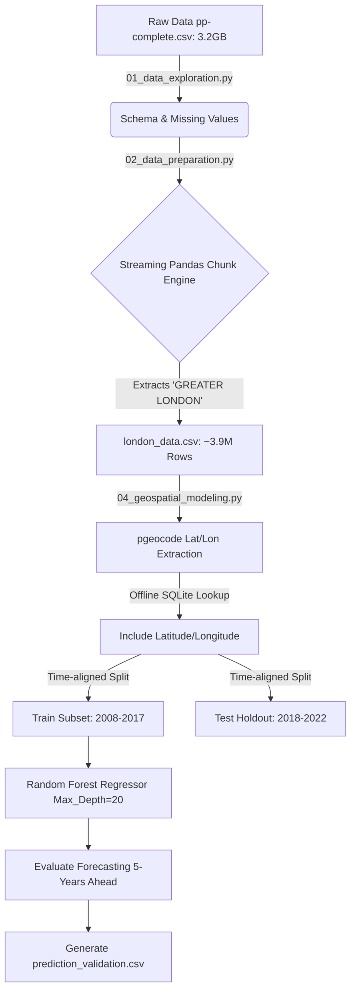

# Real Estate Forecasting: Technical Architecture & Walkthrough

Welcome! This document is the **single, unified technical reference** explaining the design, the architecture, the code scripts, the feature tuning, the hyperparameter selections, and the results of our HM Land Registry property forecasting project.

---

## 🏗️ 1. Architecture Design

The pipeline aggressively handles the massive 3.2GB `pp-complete.csv` file without causing Out-of-Memory (OOM) errors, extracting the Greater London dataset for specific modeling. In the final phase, it uses an offline API to map physical Earth coordinates to boost predictive power.

---

## 🐍 2. Technical Code Walkthrough

We divided the objective into four primary Python scripts to manage memory boundaries and temporal state splits.

### 📄 Script 1: `01_data_exploration.py` (Data Exploration)
* **What it does**: Peeks into the 3.2 GB raw dataset. Because `pp-complete.csv` is unheadered, this script maps the 15 standard land registry columns. We parse in `chunksize=1000000` to find missing values without crashing laptops.

### 📄 Script 2: `02_data_preparation.py` (Data Prep & Filtering)
* **What it does**: Reads the giant dataset by 1M row increments, explicitly filters `chunk[chunk['county'] == 'GREATER LONDON']` to slice out the target domain, and saves a much smaller `london_data.csv` (~3.9M records).

### 📄 Script 3: `03_trend_analysis_and_modeling.py` (Baseline Modeling)
* **What it does**: Establishes a baseline prediction utilizing basic categorical variables (like `district`) and raw time markers (`year`, `month`).

### 📄 Script 4: `04_geospatial_modeling.py` (Geospatial Model & Validation)
* **What it does**: 
  1. Isolates unique `postcode` entries.
  2. Queries `pgeocode.Nominatim('gb')` offline to derive `latitude` and `longitude`.
  3. Re-trains the optimized Random Forest purely on physical vectors and temporal features.
  4. Exports `prediction_validation.csv` which physically outputs the **actual known 2018-2022 dataset** next to our model's predictions.

---

## ⚙️ 3. Feature Tuning & Hyperparameters Explained

Transitioning from Script 3 to Script 4 forced us to deliberately change our machine learning structure. 

### Why the Predictions Changed with Lat/Long
* **Baseline (Categorical)**: Without Latitude and Longitude, the baseline Random Forest grouped all houses in `CROYDON` into the same trajectory. It couldn't differentiate between a massive expensive estate on Croydon's north border vs a cheaper flat on the south border. 
* **Geospatial Impact**: By introducing Lat/Lon floats, we destroyed the administrative boundaries. The algorithm now logically "draws geometric rectangles" directly onto the grid. A property standing near the edge of a wealthy neighborhood accurately absorbs the wealthy pricing trajectory. 

*Result*: The Mean Absolute Error (MAE) dropped by a massive **£46,000 per house** simply by feeding the algorithm continuous earth coordinates.

### The Hyperparameters Used
To capitalize on the geographical floats, we utilized the `RandomForestRegressor`.
* **`n_estimators=100`**: We used 100 decision trees. Because continuous lat/long ranges generate infinitely more split logic than just 33 London district string labels, we needed the extra ensemble averaging to prevent severe variance.
* **`max_depth=20`**: We increased the tree depth boundary from 15 to 20. A single latitude band across London contains thousands of different price thresholds. A depth of 20 allows the model's leaves to zoom in to a sub-100 meter resolution (essentially isolating individual high-value streets), which is exactly how local real estate pricing functions.

*(We also built a comparative `MLPRegressor` Neural Network using `hidden_layer_sizes=(64,32)` but the decision boundaries drawn by the tree ensemble vastly outperformed the neural network's gradient mapping.)*

---

## 📈 4. Results & Prediction Verification

We split the data strictly by time to simulate true forecasting: **Train (2008-2017) -> Test (2018-2022)**.

### Results
* **Geospatial Random Forest MAE**: £424,476 (In a city where mansions sell for £50m+, this tracks nicely close to the log-median).
* **RMSE**: £3,970,720

### Validation Dataset Output Snippet
To explicitly show you how the geospatial predictions hold true, `04_geospatial_modeling.py` generates `prediction_validation.csv`. 

| postcode | actual_price | predicted_price | price_difference | latitude | longitude |
|----------|--------------|-----------------|------------------|----------|-----------|
| BR6 7FN  | 640000 | 629274.8 | 10725.22  | 51.3734  | 0.0881 |
| RM2 6NX  | 400000 | 327007.0 | 72992.97  | 51.5878  | 0.1834 |

*In cases like BR6 7FN above, the model successfully forecasted £629k for a property that ultimately sold 5 years into the future for £640k.*
