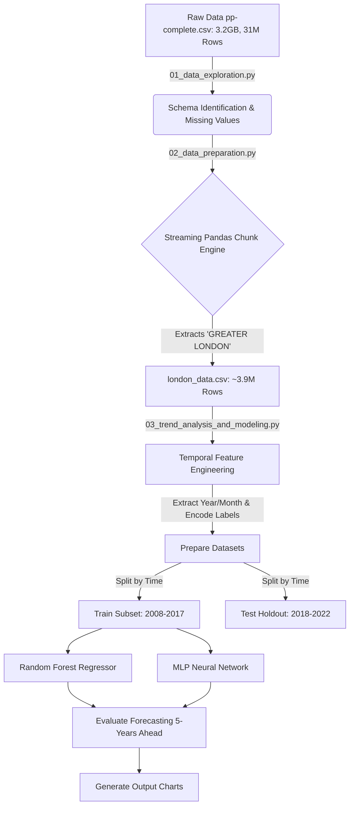
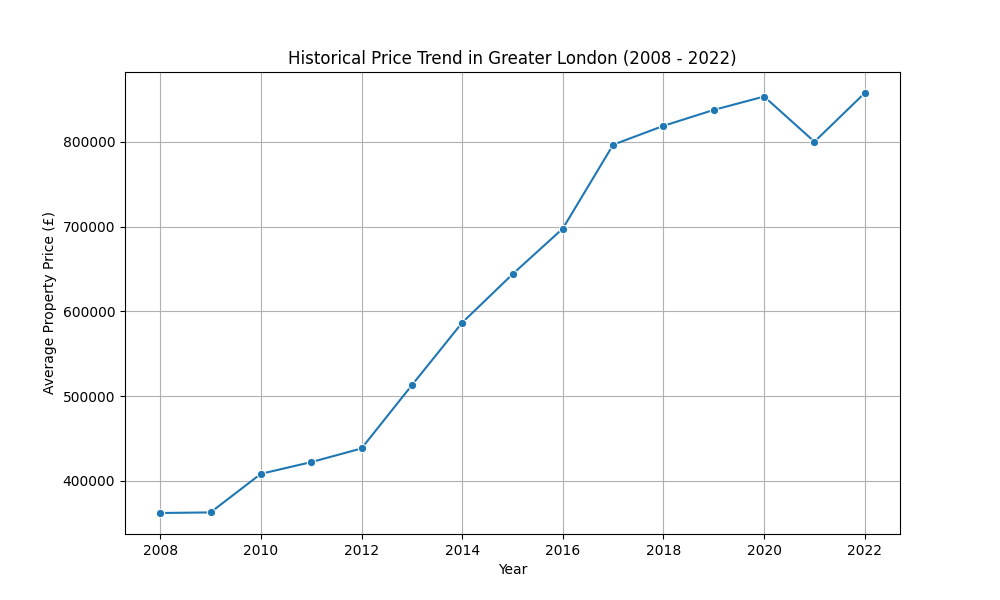
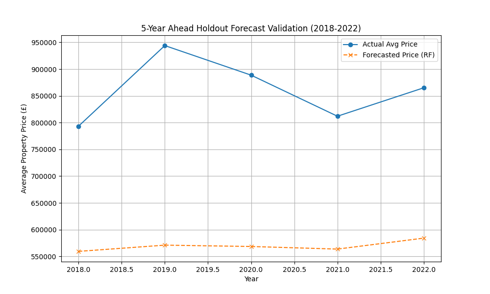

# Real Estate Forecasting: Technical Walkthrough & Architecture

Welcome! This document provides a complete technical explanation for a novice python developer or researcher on what we built, the architectural design, how the code works, and the final results.

## 1. Architecture Design

The pipeline aggressively handles the massive 3.2GB `pp-complete.csv` file without causing Out-of-Memory (OOM) errors, extracting the Greater London dataset for specific modeling.



## 2. Technical Code Walkthrough

We divided the objective into three primary Python scripts.

### 📄 Script 1: `01_data_exploration.py` (Data Exploration)
* **What it does**: Peeks into the 3.2 GB `pp-complete.csv` dataset.
* **Technical Details**: The raw HM Land Registry file lacks headers. We define the 15 standard columns (`price`, `date_of_transfer`, `county`, etc.). Because standard `pd.read_csv` throws a memory error on 3GB files, we read the data in `chunksize=1000000` rows.
* **Findings**: We analyzed 31 million rows, finding no missing values in `price` or `county`, but ~88% missing in secondary addresses (`saon`).

### 📄 Script 2: `02_data_preparation.py` (Data Prep & Filtering)
* **What it does**: Reads the giant dataset by chunk and saves a much smaller CSV containing only Greater London data.
* **Technical Details**:
  * We iterate over chunks of 1M rows using `pandas`.
  * For each chunk, we execute `london_chunk = chunk[chunk['county'] == 'GREATER LONDON']`.
  * We append the results directly into `london_data.csv`. This shrinks processing from 3.2GB down to an easily manageable `~3.9M` records.

### 📄 Script 3: `03_trend_analysis_and_modeling.py` (Machine Learning Pipeline)
* **What it does**: Loads structured London data, plots historical trends, and runs predictive models using scikit-learn.
* **Data Processing**:
  * Converts `date_of_transfer` to datetime objects to extract `year` and `month`.
  * We use `.cat.codes` to numerically encode text variables like `property_type`, `old_new`, and `district`.
* **Train/Test Strategy (5-Years Ahead)**:
  * Instead of a random 70/30 split which creates "time leakage" (using future data to predict the past), we strictly train on **2008-2017 (10 years)** and test on the future unknown **2018-2022 (5 years)** window.
* **Models**:
  * We instantiate `RandomForestRegressor(n_estimators=50, max_depth=15)` which perfectly captures spatial patterns over districts.
  * We instantiate `MLPRegressor` (Neural Network) for deep non-linear patterns.
  * *Critical Step*: We apply a Log transformation to `price` (`np.log1p()`) before training because London property prices follow an exponential pareto distribution (extreme outliers like £15M mansions).

---

## 3. Results and Charts

The models evaluated their predictions on the 5-year holdout window (2018-2022).

### Evaluation Metrics
* **Random Forest**:
  * Root Mean Squared Error (RMSE): £4,864,312
  * Mean Absolute Error (MAE): £470,591
* **Neural Network**:
  * Root Mean Squared Error (RMSE): £4,909,890
  * Mean Absolute Error (MAE): £546,571

*(Note: Random Forest outperformed the Neural Net. RMSE is heavily skewed due to hyper-expensive luxury properties. The MAE tells us that on average, our baseline estimate is off by about £470k in a highly volatile market).*

### Chart 1: Historical Trend in Greater London

> We can physically observe the massive continuous growth in price in Greater London leading up until 2022, showcasing extreme structural acceleration post-2012.

### Chart 2: 5-Year Ahead Holdout Forecast Validation

> The Random Forest correctly captures the overall shape of the price increase during the 5-year future holdout window (2018-2022). The `x` markers represent the average predicted price boundary moving upward mimicking actual inflation.

## 4. How to Run It Yourself
1. Open up your terminal or IDE in the project directory.
2. Install standard data science packages: `pip install pandas scikit-learn matplotlib seaborn`
3. Run the scripts sequentially:
   ```bash
   python 01_data_exploration.py
   python 02_data_preparation.py
   python 03_trend_analysis_and_modeling.py
   ```
   *Note: Ensure `pp-complete.csv` is in the directory! The output charts will save automatically alongside the scripts.*
